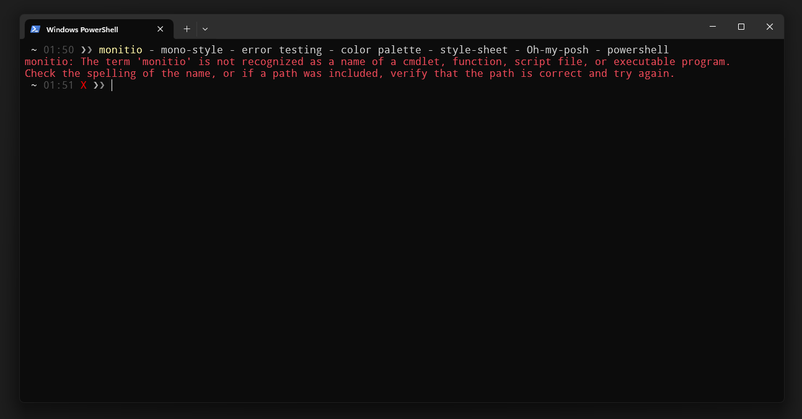
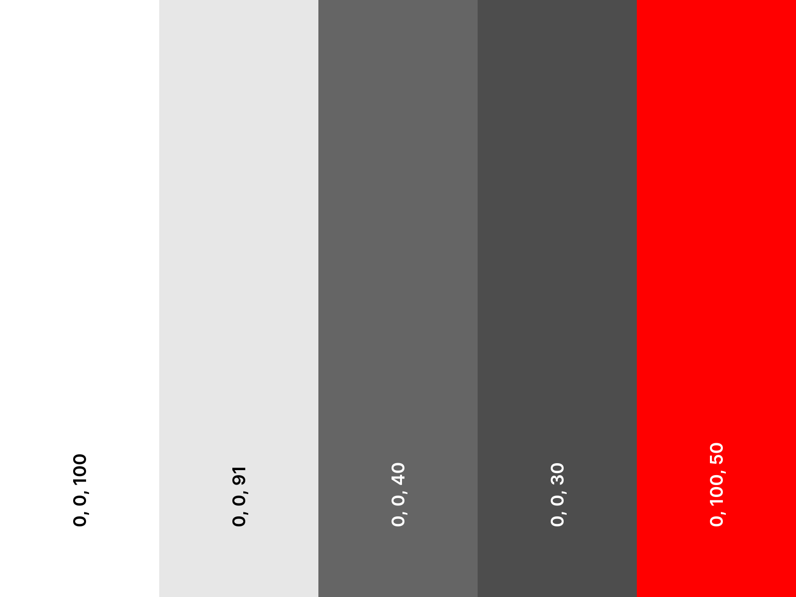
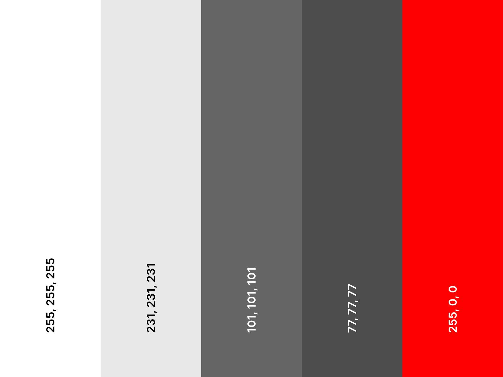
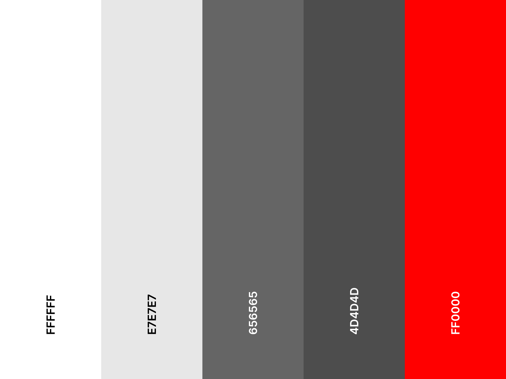

# mono-style
An style based on a monochromatic colour palette for any one to use.

---

## Formats:

| Format   | Description                |
|----------|----------------------------|
| HSL      | [Here](./src/schemes/hsl)  |
| RGB      | [Here](./src/schemes/rgb)  |
| HEX      | [Here](./src/schemes/hex)  |
| Coolors - palette | [Here](https://coolors.co/palette/ffffff-e7e7e7-656565-4d4d4d-ff0000) |
| XML      | [Here](./src/schemes/xml/palette.xml) |
| Oh-My-Posh - Style-sheet | [Here](./src/monostyle.omp.json) |
| Oh-My-Posh - Raw Style-sheet | [Here](https://raw.githubusercontent.com/monitio/mono-style/refs/heads/main/src/monostyle.omp.json) |
| CSS      | [Here](./src/schemes/css/) (contains more than just plain CSS 😉)  |
| Palettes | In the specific type folders. Like `./src/schemes/hsl|rgb|hex/images/palette.png` |

---

## Images:
*Oh-My-Posh - Powershell - Windows*:

 

---
*HSL - palette*:

 

---
*RGB - palette*:

 

---
*HEX - palette*:

 

